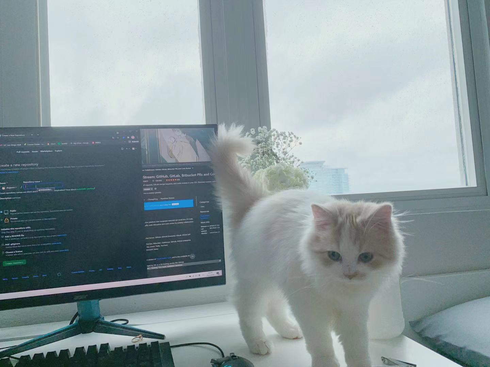

# Hannah's User Page

> I'm Hannah Lyu. A senior in UCSD majoring in Cognitive Science.

### Who I am as a Programmer

*I can code in Java, Python, javascript and C++. Maybe some C and R language.*

### My Interests

```
System.out.println("I love designing and implementing experiments!")
```

[Link to my Github Page](https://github.com/dugurrn)

[My README file](README.md)

[Jumping back to who I am as a Programmer](#who-i-am-as-a-programmer)

Classes I'm taking this quarter for CSE
 - CSE110
 - CSE101
 - CSE130
  
Top 3 Favorite Location on Campus
1. Geisel
2. Biomed
3. Price Center

Plans for this quarter
- [ ] ATTEND LECTURES
- [ ] STUDY HARD
- [ ] HAVE FUN

My Favorite Cat 
